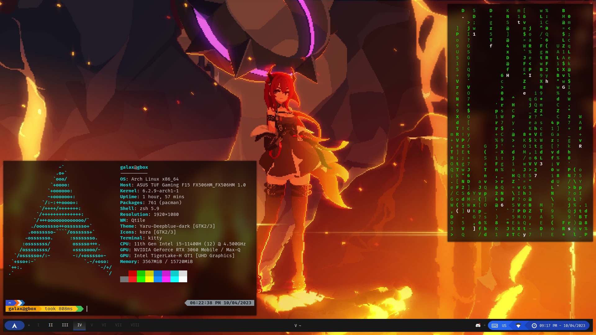

# Dotfiles

## What I use

- **Distro:** Arch Linux
- **DM:** None, I use [startx](https://wiki.archlinux.org/title/Xinit)
- **WM:** Qtile
- **Bar:** Qtile (w/Qtile Extras)
- **Compositor:** Picom (Jonaburg's Fork)
- **App Launcher/Window Switcher:** Rofi
- **Notification:** Dunst
- **GTK/Qt Theme:** Yaru Deepblue
- **Icon Theme:** Kora
- **Terminal:** Kitty
- **Shell:** ZSH
- **Editor:** VS Code
